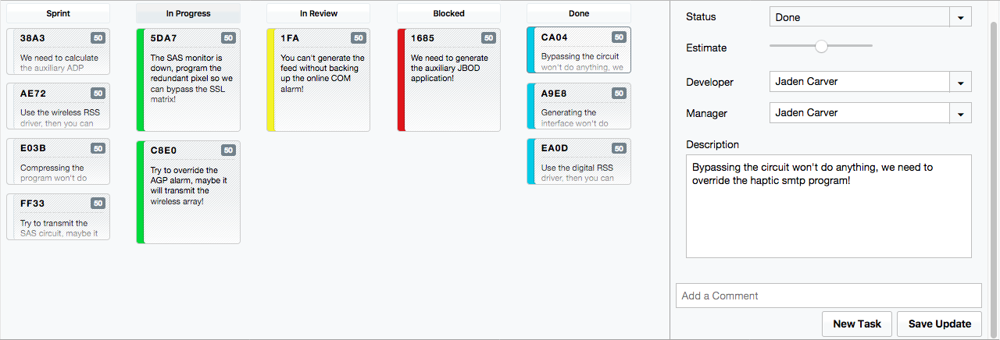

# Superconductor

Superconductor is a Workflow and Project Management tool.

It is written in `rust-lang/rust` and you currently have to compile the dylib manually.
Install `rust-lang/rust` and `rust-lang/cargo` and then run `./bin/start`.

To compile the release build for use by the gem, run `./bin/release`.



## Installation

Add this line to your application's Gemfile:

```ruby
gem 'superconductor'
```

And then execute:

    $ bundle

Or install it yourself as:

    $ gem install superconductor

From here, you can [Try Superconductor](javascript:PM.toggle();).
For more information, see [Contributing](#label-Contributing).

## Usage

### Ruby on Rails

In your `config/environments/development.rb` file, add {Superconductor::Middleware}

```
config.middleware.insert_before(ActionDispatch::DebugExceptions, Superconductor::Middleware)
```

### Rack

```
require 'superconductor'

use Superconductor::Middleware
run MyApp
```

## Contributing

Bug reports and pull requests are welcome on GitHub at https://github.com/jadencarver/superconductor.


## License

The gem is available as open source under the terms of the [MIT License](http://opensource.org/licenses/MIT).

